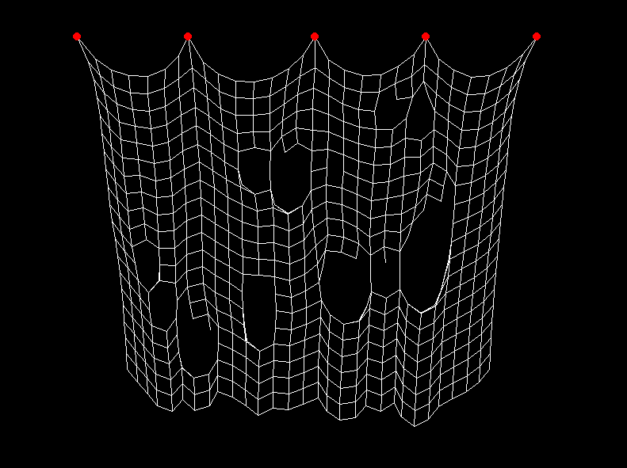

# Cloth Simulation

Simple cloth simulation using [Verlet Integration](https://en.wikipedia.org/wiki/Verlet_integration "Verlet Integration"). You could also use this method to simulate a rope.

# Commands

- left click to move the rest points (red circles)
- right click to cut cloth

# How To Use

You need to have python and pygame installed.
